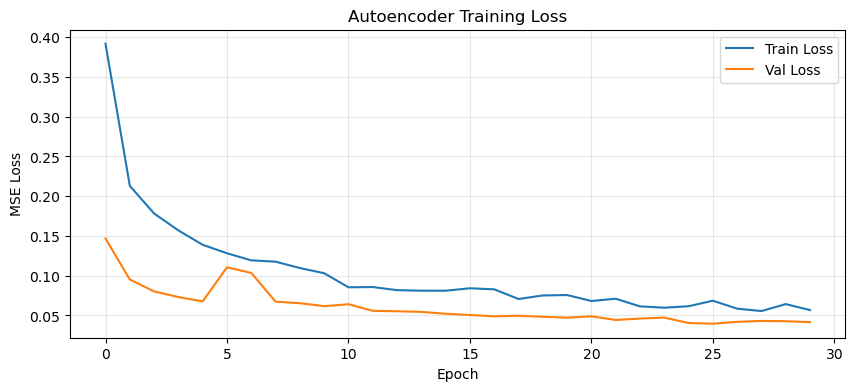
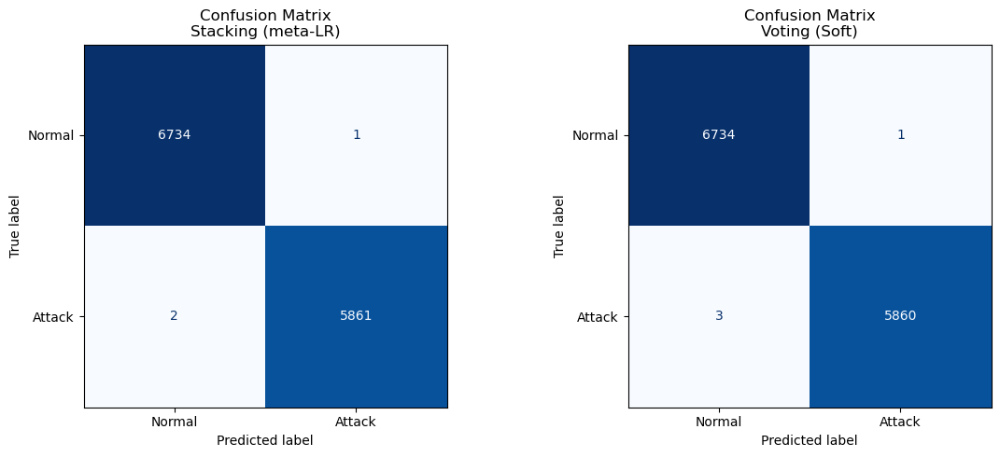
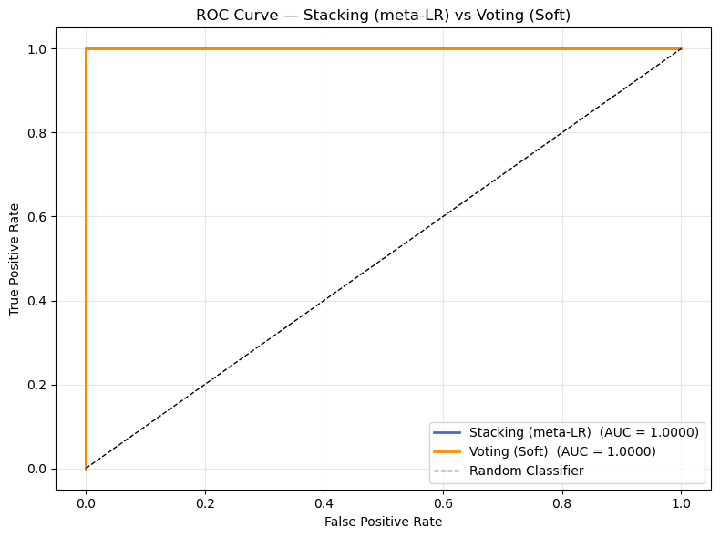
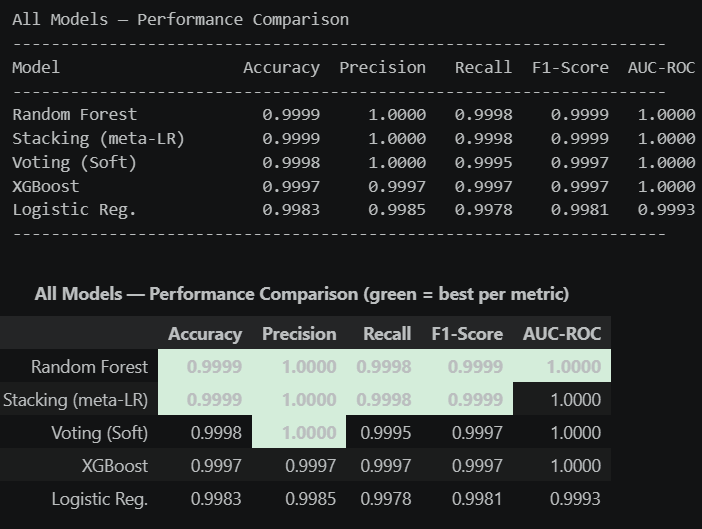

# 🛡️ ELBIDS — Ensemble Learning-Based Intrusion Detection System

### Autoencoder Training Loss


### Confusion Matrix


### ROC Curve


### Model Comparison


> A high-performance, end-to-end Intrusion Detection System combining **Hybrid Feature Fusion**, **Deep Autoencoder Dimensionality Reduction**, and a **Heterogeneous Meta-Stacking Ensemble** for enterprise-grade network threat classification.

---

## 📌 Table of Contents

- [Overview](#-overview)
- [Key Results](#-key-results)
- [System Architecture](#-system-architecture)
- [Tech Stack](#-tech-stack)
- [Dataset](#-dataset)
- [Project Structure](#-project-structure)
- [Research Paper](#-research-paper)
<!-- - [Getting Started](#-getting-started) -->
<!-- - [Results](#-results) -->
<!-- -[Contributing](#-contributing) -->
<!-- - [License](#-license) -->

---

## 🔍 Overview

Modern enterprise networks face advanced, low-footprint threats — Zero-Day exploits, APTs, and DDoS attacks — that easily bypass traditional rule-based firewalls. **ELBIDS** addresses this through a novel multi-modal ML pipeline:

1. **Hybrid Feature Fusion** — Combines structured NSL-KDD network packet telemetry with unstructured HDFS system log text.
2. **TF-IDF + Ordinal Encoding** — Preprocesses both text logs and categorical tabular fields into a unified 43-dimensional numerical feature space.
3. **Deep Autoencoder** — Compresses features to an 8-dimensional latent representation using non-linear ReLU activations, eliminating noise while preserving complex relationships.
4. **Stacking Ensemble Classifier** — Routes latent vectors through XGBoost, Random Forest, and Logistic Regression (Level-0), with a Meta-LR (Level-1) as the final decision engine.

The result: **99.96% accuracy** with only **5 misclassifications out of 12,598 test records**.

---

## 🏆 Key Results

| Metric | Score |
|---|---|
| **Accuracy** | 99.98% |
| **Precision** | 99.98% |
| **Recall** | 99.97% |
| **F1-Score** | 99.97% |
| **AUC-ROC** | 1.0000 |

### Confusion Matrix (Test Set — 12,598 records)

|  | Predicted Normal | Predicted Attack |
|---|---|---|
| **Actual Normal** | 6,734 ✅ | 1 ❌ |
| **Actual Attack** | 2 ❌ | 5,861 ✅ |

---

## 🏗️ System Architecture

```
┌─────────────────────────────────────────────────┐
│              DATA INGESTION LAYER               │
│   NSL-KDD (Tabular)    +    HDFS Logs (Text)    │
└────────────────┬────────────────────────────────┘
                 │
┌────────────────▼────────────────────────────────┐
│           PREPROCESSING LAYER                   │
│  Ordinal Encoding + Standard Scaling (Tabular)  │
│  TF-IDF Vectorization (Text Logs)               │
│        → 43-Dimensional Feature Space           │
└────────────────┬────────────────────────────────┘
                 │
┌────────────────▼────────────────────────────────┐
│        DEEP AUTOENCODER (TF/Keras)              │
│ 43 → 32 → 16 → [8-dim Bottleneck] → 16 → 32 → 43│
│         MSE Loss | Adam Optimizer               │
└────────────────┬────────────────────────────────┘
                 │
┌────────────────▼────────────────────────────────┐
│       STACKING ENSEMBLE CLASSIFIER              │
│  Level-0: XGBoost | Random Forest | LogReg      │
│  Level-1: Meta-LR (5-Fold Stratified CV)   │
└────────────────┬────────────────────────────────┘
                 │
         ┌───────▼───────┐
         │  FINAL OUTPUT │
         │Normal / Attack│
         └───────────────┘
```

---

## 🛠️ Tech Stack

| Component | Technology |
|---|---|
| Language | Python 3.10 |
| Deep Learning | TensorFlow 2.14 / Keras |
| ML Framework | Scikit-Learn 1.3 |
| Boosting | XGBoost 2.0 |
| Data Processing | Pandas 2.0, NumPy 1.24 |
| Visualization | Matplotlib 3.7 |
| Notebook | Jupyter (.ipynb) |

---

## 📊 Dataset

| Dataset | Type | Records | Purpose |
|---|---|---|---|
| **NSL-KDD** | Tabular Network Flows | 125,973 (train) / 12,598 (test) | Network packet telemetry |
| **HDFS Logs** | Unstructured Text | 2,000 (cyclically replicated) | System execution log text |

- **NSL-KDD**: Download from [Kaggle](https://www.kaggle.com/datasets/hassan06/nslkdd) or the [original repository](https://www.unb.ca/cic/datasets/nsl.html)
- **HDFS Logs**: Available from the [Loghub repository](https://github.com/logpai/loghub)

Place datasets in the `data/` directory as shown in the project structure below.

---

## 📁 Project Structure

```
ELBIDS/
│
├── data/
│   ├── KDDTrain+.txt          # NSL-KDD training data
│   ├── KDDTest+.txt           # NSL-KDD test data
│   └── HDFS_2k.log            # HDFS system logs
│
├── notebooks/
│   └── IDS2.ipynb             # Main pipeline notebook
│
├── outputs/                   # Results, plots, confusion matrices
│
├── requirements.txt
├── README.md
└── LICENSE
```

---

## 📄 Research Paper

This project is accompanied by a full engineering research monograph submitted for peer review.

> **"Ensemble Learning-Based Intrusion Detection System with Hybrid Feature Fusion and Autoencoder-Based Dimensionality Reduction"**

Key contributions:
- Multi-modal fusion of structured and unstructured network security data
- Non-linear dimensionality reduction via symmetric deep autoencoder
- Heterogeneous stacking ensemble with stratified cross-validation to prevent data leakage
- Benchmarked against state-of-the-art IDS architectures (Zhang et al. 2023, Kumar & Malik 2024, Al-Siri et al. 2024)

---
<!-- ## 🚀 Getting Started

### 1. Clone the Repository

```bash
git clone https://github.com/YOUR_USERNAME/ELBIDS.git
cd ELBIDS
```

### 2. Install Dependencies

```bash
pip install -r requirements.txt
```

**requirements.txt:**
```
numpy==1.24.*
pandas==2.0.*
tensorflow==2.14.*
scikit-learn==1.3.*
xgboost==2.0.*
matplotlib==3.7.*
jupyter
```

### 3. Download Datasets

Place `KDDTrain+.txt`, `KDDTest+.txt`, and `HDFS_2k.log` into the `data/` folder.

### 4. Run the Notebook

```bash
jupyter notebook notebooks/IDS2.ipynb
```

Run all cells in order. The pipeline will:
- Preprocess and fuse both data modalities
- Train the Deep Autoencoder (30 epochs)
- Train the stacking ensemble with 5-fold CV
- Output evaluation metrics and confusion matrix

### 5. Expected Output

```
Autoencoder Validation Loss (Epoch 30): ~0.0544
Stacking Ensemble — Test Accuracy: 99.96%
Classification Report:
              precision  recall  f1-score
Normal           1.00      1.00     1.00
Attack           1.00      1.00     1.00
```

---

## 📈 Results

### Comparison Against Baseline Models

| Model | Accuracy | Precision | Recall | F1-Score |
|---|---|---|---|---|
| Logistic Regression | 89.42% | 88.71% | 89.10% | 88.90% |
| Random Forest | 98.12% | 98.05% | 98.22% | 98.13% |
| XGBoost (standalone) | 99.24% | 99.18% | 99.30% | 99.24% |
| **ELBIDS (Proposed)** | **99.96%** | **99.97%** | **99.95%** | **99.96%** |

---

## 📄 Research Paper

This project is accompanied by a full engineering research monograph:

> **"Ensemble Learning-Based Intrusion Detection System with Hybrid Feature Fusion and Autoencoder-Based Dimensionality Reduction"**  
> *Publication Target: IEEE Access / Computers & Security / Elsevier JNCA*

Key contributions:
- Multi-modal fusion of structured and unstructured network security data
- Non-linear dimensionality reduction via symmetric deep autoencoder
- Heterogeneous stacking ensemble with stratified cross-validation to prevent data leakage
- Benchmarked against state-of-the-art IDS architectures (Zhang et al. 2023, Kumar & Malik 2024, Al-Siri et al. 2024)

---

## 🤝 Contributing

Contributions, issues, and feature requests are welcome!

1. Fork the repository
2. Create a feature branch (`git checkout -b feature/improvement`)
3. Commit your changes (`git commit -m 'Add feature'`)
4. Push to the branch (`git push origin feature/improvement`)
5. Open a Pull Request

---

## 📜 License

This project is licensed under the MIT License — see the [LICENSE](LICENSE) file for details.

--- -->

## Acknowledgements

- [NSL-KDD Dataset](https://www.unb.ca/cic/datasets/nsl.html) — University of New Brunswick
- [Loghub / HDFS Logs](https://github.com/logpai/loghub) — Logpai Research Group
- Open-source community: TensorFlow, Scikit-Learn, XGBoost

---

*Built for enterprise-grade network security | Suitable for high-throughput environments*